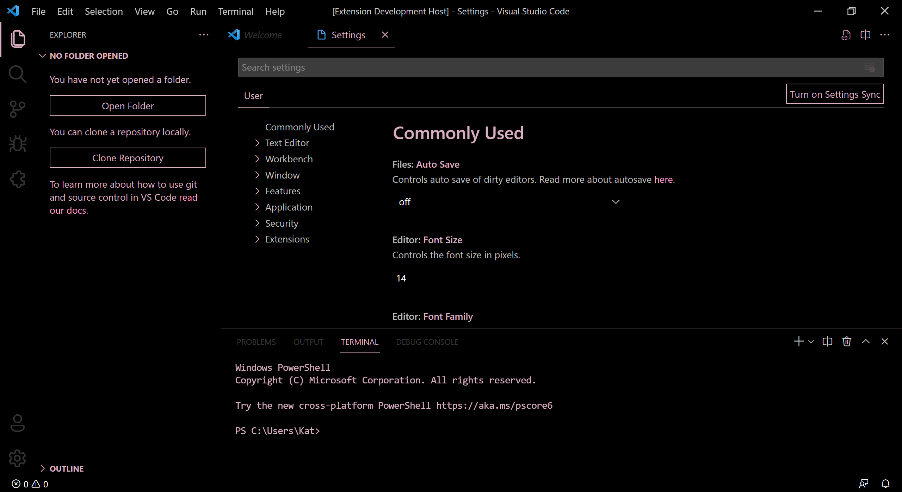

# Limey Theme Pack for VS Code

A light and dark color theme pack created for _Visual Studio Code_.

**NOTE: If there are any issues, please [let us know](#source) if you have any down below.**

## Includes

Includes the Green, Lime, and Pink theme in these colors:

- Light themes
    - Light
    - Lighter
    - Lightest
- Dark themes
    - Dark
    - Darker
    - Darkest

## Screenshots

- Light themes
    - Light
        - Green (Limey Theme Green Light)
        
        - Lime (Limey Theme Lime Light)
        
        - Pink (Limey Theme Pink Light)
        
    - Lighter
        - Green (Limey Theme Green Lighter)
        
        - Lime (Limey Theme Lime Lighter)
        
        - Pink (Limey Theme Pink Lighter)
        
    - Lightest
        - Green (Limey Theme Green Lightest)
        
        - Lime (Limey Theme Lime Lightest)
        
        - Pink (Limey Theme Pink Lightest)
        
- Dark themes
    - Dark
        - Green (Limey Theme Green Dark)
        
        - Lime (Limey Theme Lime Dark)
        
        - Pink (Limey Theme Pink Dark)
        
    - Darker
        - Green (Limey Theme Green Darker)
        
        - Lime (Limey Theme Lime Darker)
        
        - Pink (Limey Theme Pink Darker)
        
    - Darkest
        - Green (Limey Theme Green Darkest)
        
        - Lime (Limey Theme Lime Darkest)
        
        - Pink (Limey Theme Pink Darkest)
        

<!-- ... coming soon -->

## Source

You can [view the source code on GitHub](https://github.com/limeyteam/themes).